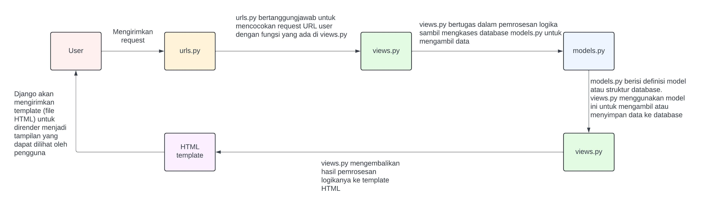
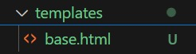
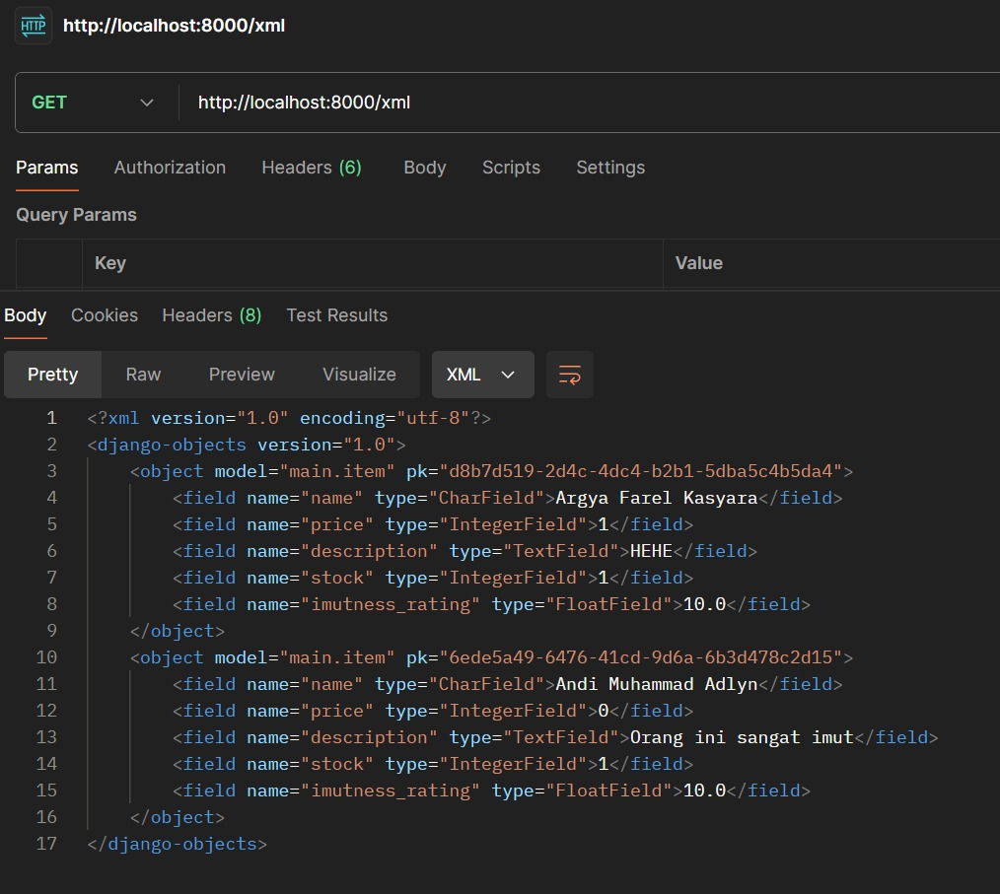
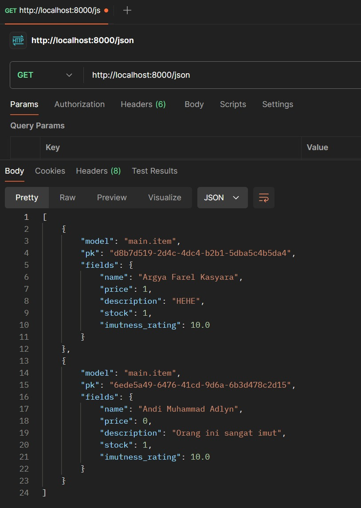
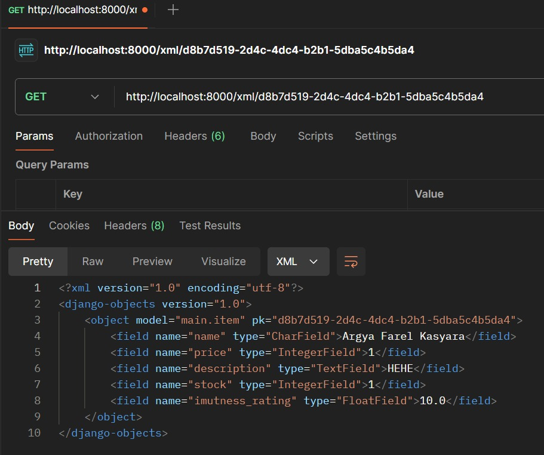
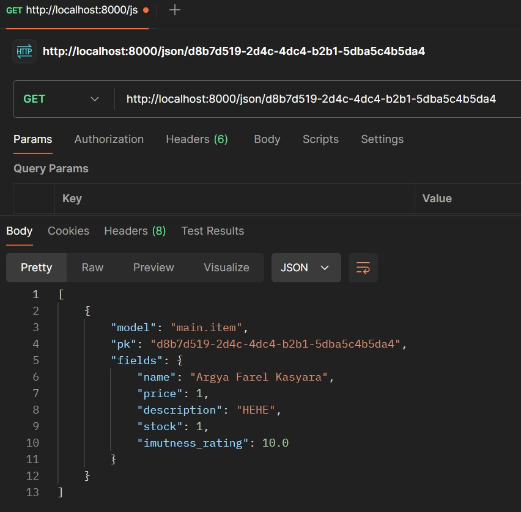

## Nama : Argya Farel Kasyara
## NPM : 2306152424
## Kelas : PBP C

## Tautan PWS : http://argya-farel-warungimut.pbp.cs.ui.ac.id/

## Link Tugas
- [Tugas 2](#tugas-2)
- [Tugas 3](#tugas-3)
- [Tugas 4](#tugas-4)
- [Tugas 5](#tugas-5)


## Tugas 2
### 1. Jelaskan bagaimana cara kamu mengimplementasikan checklist di atas secara step-by-step (bukan hanya sekadar mengikuti tutorial).
#### a. Untuk membuat proyek Django baru, hal yang pertama yang dilakukan adalah membuat direktori baru dengan nama "warung-imut" sebagai folder proyek. Setelah itu, saya buat repositori git baru dengan command "git init". Saya buat virtual environment python lalu saya install library-library yang akan dibutuhkan dan akhirnya saya jalankan command "django-admin startproject warung_imut". Hal ini akan membuat proyek Django. Saya juga tambahkan dua string ("localhost", "127.0.0.1") pada ALLOWED_HOSTS di settings.py.
#### b. Untuk membuat aplikasi dengan nama main dalam proyek, saya lakukan command "python manage.py startapp main" pada direktori warung-imut utama. 
#### c. Melakukan routing pada proyek agar dapat menjalankan aplikasi main dapat diimplementasikan  dengan menambahkan 'main' pada variabel INSTALLED_APPS di settings.py dan menambahkan path urlspattern path('', include('main.urls')) di urls.py direktori warung imut. 
#### d. Membuat model pada aplikasi main dengan ketentuan tugas dapat diimplementasikan dengan mendefinisikan sebuah class Item yang inherit dari Django model lalu memberikan attribute yang sesuai di file models.py pada direktori main.
#### e. Membuat sebuah fungsi pada views.py untuk dikembalikan ke dalam sebuah template HTML dapat diimplementasikan dengan mendefinisikan fungsi yang mengembalikan render template HTML sesuai dengan konteks yang diberikan. Konteks disini adalah nama, kelas, dan npm.
#### f. Membuat sebuah routing pada urls.py aplikasi main untuk memetakan fungsi yang telah dibuat pada views.py dapat diimplementasikan dengan membuat list yang berisikan path ke fungsi yang ada di views.py urls = [path('', show_main, name='show_main')]
#### g. Melakukan deployment ke PWS terhadap aplikasi yang sudah dibuat sehingga nantinya dapat diakses oleh teman-temanmu melalui Internet dapat diimplementasikan dengan membuat proyek baru di pws, lalu menambahkan ALLOWED_HOST di settings.py pada direktori utama dengan "argya-farel-warungimut.pbp.cs.ui.ac.id". Akhirnya saya melakukan instruksi yang sesuai di pwsnya agar repo proyek saya dibuild di pwsnya.
#### h. Membuat README.md sesuai dengan perintah soal dengan mempelajari materi yang terkait dengan pertanyaan dan menjawabnya dengan baik

### 2. Buatlah bagan yang berisi request client ke web aplikasi berbasis Django beserta responnya dan jelaskan pada bagan tersebut kaitan antara urls.py, views.py, models.py, dan berkas html.


### 3. Jelaskan fungsi git dalam pengembangan perangkat lunak!
#### a. Git berperan sebagai version control system yang membantu developer dalam mengatur dan melacak perubahan dalam kode. Hal ini membuatnya penting dalam kolaborasi antara banyak developer, sehingga masing-masing developer dapat berkontribusi dengan baik. 
#### b. Pemberian arsitektur tersebar sehingga setiap developer memiliki salinan sejarah dari proyek yang sedang dibuatnya. Jika salah satu developer kehilangan proyek, salinannya masih ada di orang lain.
#### c. Memudahkan perbaikan kesalahan. Git memungkinkan developer untuk membatalkan perubahan atau kembali ke versi sebelumnya jika terjadi bug atau kesalahan yang tidak diingkan.
#### d. Memfasilitasi review kode. Git memfasilitasi peer review dengan memungkinkan developer untuk memerika atau mengomentari kode orang lain melalu pull request.
#### e. Git memungkinkan developer untuk membuat branches dengan fitur baru atau memperbaiki bug tanpa memperangurhi tempat kode utama. Setelah branches ini sudah selesai dan dites maka branches tersebut dapat dikembalikan kembali ke kode utama.

### 4. Menurut Anda, dari semua framework yang ada, mengapa framework Django dijadikan permulaan pembelajaran pengembangan perangkat lunak?
#### a. Dikarenakan Django sangat-sangat populer dan banyak sekali tutorial-tutorial untuk mempelajarinya. Hal ini membuat  kita sebagai pelajar mudah dan cepat untuk memahaminya
#### b. Memiliki struktur yang jelas dan konsisten. Django mengikuti arsitektur Model-View-Template (MVT) yang memisahkan bagian-bagian web dengan jelas sehingga kita dapat dengan mudah memahaminya.
#### c. Django menggunakan bahasa pemrograman yang sangat popular dan memiliki sintaks yang cukup mudah yaitu Python. Hal ini membuat kita lebih fokus terhadap konsep-konsep yang dipelajari dibandingkan mempelajari sintaks.
#### d. Django sudah menyertakan perlindungan bawaan terhadap kerentanan umum seperti injeksi SQL dan lain-lain. Hal ini membantu pemula menulis kode aman dan membuat pemula tidak perlu terlalu fokus terhadap aspek ini melainkan terhadap aspek-aspek web.
#### e. Django sangat lengkap dan comprehensive untuk membuat web dan bisa digunakan oleh aplikasi skala besar. Django juga mendorong penulisan kode yang efisien dan bersih dengan menghindari duplikasi. Hal ini akan menanam kebiasaan yang baik dalam menulis kode.

### 5. Mengapa model pada Django disebut sebagai ORM?
#### Karena Django menyediakan abstraksi yang memungkinkan developer untuk berinteraksi dengan basis data relasional menggunakan objek Python, daripada menulis kueri SQL mentah saja. Django ORM mengabstraksikan kueri SQL dan menyedikan cara yang lebih "Python" untuk bekerja dengan basis data.

## Tugas 3
### 1. Jelaskan mengapa kita memerlukan data delivery dalam pengimplementasian sebuah platform?
#### a. Menghubungkan pengguna dengan aplikasi atau backend. Data delivery memastikan bahwa informasi dari backend dapat dikirim ke pengguna (frontend) secara tepat waktu dan efisien.
#### b. Pengelolaan data yang dinamis. Konten yang ditampilkan kepada pengguna dapat berubah berdasarkan aktivitas pengguna tersebut. OLeh sebab itu, agar aplikasi tetap interaktif diperlukan mekanisme data delivery.
#### c. Sistem notifikasi dan pembaruan real-time. Aplikasi modern biasanya memerlukan sebuah mekanisme untuk mengirimkan data secara real-time, contohnya notifikasi atau pembaruan status. Hal ini membutuhkan data delivery sistem yang baik.

### 2. Menurutmu, mana yang lebih baik antara XML dan JSON? Mengapa JSON lebih populer dibandingkan XML?
#### Menurut saya, JSON lebih baik dikarenakan lebih ringkas dan sintaksnya menyerupai dictionary python sehingga mudah dipahami bagi saya. Formatnya juga lebih informatif.
#### Alasan JSON lebih populer dibandingkan XML:
##### a. JSON lebih ringkas, sederhana serta mudah dipahami oleh kita.
##### b. JSON lebih cepat diparse oleh browser dan aplikasi karena strukturnya sederhana dan sudah di optimasikan.
##### c. JSON memiliki hubungan yang lebih erat dengan JavaScript karena merupakan bagian dari notasi objek dalam JS.
##### d. JSON lebih fleksibel dan ringan sehingga untuk keperluan keseharian dan tidak kompleks, JSON lebih preferable.

### 3. Jelaskan fungsi dari method is_valid() pada form Django dan mengapa kita membutuhkan method tersebut?
#### Fungsi dari method is_valid() adalah memvalidasikan semua input terkait dengan field dalam sebuah forum. Misal, sebuah field mengharuskan integer, maka ia akan check apakah inputnya integer atau tidak. Fungsi ini akan mengembalikan nilai True jika semua validasi berhasil dan False jika ada kesalahan. Jika ada kesalahan, informasi tentang error akan disimpan di atribut errors.
#### Alasan mengapa kita membutuhkan is_valid():
##### a. Keamanaan. Validasi dengan is_valid() sangat penting untuk mencegah input yang tidak diinginkan atau berbahaya seperti injection.
##### b. Integritas Data. Dengan memvalidasi input, maka kita dapat memastikan data yang masuk ke dalam sistem sesuai dengan tipe dan memiliki format yang benar.
##### c. User Experience (UX). Menggunkaan is_valid(), apabila sebuah user melakukan kesalahan dalam input, maka umpan balik mengenai error tersebut akan langsung diberikan.

### 4. Mengapa kita membutuhkan csrf_token saat membuat form di Django? Apa yang dapat terjadi jika kita tidak menambahkan csrf_token pada form Django? Bagaimana hal tersebut dapat dimanfaatkan oleh penyerang?
#### Alasan kita membutuhkan csrf_token saat membuat form di Django dikarenakan CSRF token membantu memastikan bahwa permintaan yang dikirimkan ke server berasal dari pengguna yang "valid" dan bukan yang sumber "jahat". Hal ini berguna untuk melindungi aplikasi dari penyerang yang mungkin mencoba membuat form jahat di situs web lain dan mengirimkannya ke aplikasi. 

#### Jika kita tidak menambahkan csrf_token pada form Django maka seorang penyerang dapat membuat form palsu di situs mereka dan meminta pengguna yang sudah terautentikasi di sistem kita untuk mengirimkan data ke aplikasi web kita. Dengan ini, penyerang dapat menyalahgunakan data yang seharusnya terlindungi. Penyerang bisa melakukan tidakan penting atau sensitif seperti transfer uang atau pengaturan akun tanpa izin yang benar.

### 5. Jelaskan bagaimana cara kamu mengimplementasikan checklist di atas secara step-by-step (bukan hanya sekadar mengikuti tutorial).
#### a. Saya buat direktori templates pada direktori utama (root folder) dan buat sebuah berkas HTML baru bernama base.html

```bash

<!DOCTYPE html>
<html lang="en">
  <head>
    <meta charset="UTF-8" />
    <meta name="viewport" content="width=device-width, initial-scale=1.0" />
     
  </head>

  <body>
     
  </body>
</html>
```
#### b. Pada settings.py yang ada pada direktori proyek warung_imut saya ubah kode variabel template dengan seperti berikut
```bash
TEMPLATES = [
    {
        'BACKEND': 'django.template.backends.django.DjangoTemplates',
        'DIRS': [BASE_DIR / 'templates'], 
        'APP_DIRS': True,
        ...
    }
]
```
#### c. Pada subdirektori templates yang ada pada direktori main, saya ubah kode berkas main.html seperti berikut
```bash

 
 <h1>Warung Imut</h1>

 <h5>NPM: </h5>
 <p>{{ npm }}<p>

 <h5>Name:</h5>
 <p>{{ name }}</p>

 <h5>Class:</h5>
 <p>{{ class }}</p>
 
<p>Belum ada data item pada warung imut.</p>

<table>
  <tr>
    <th>Item Name</th>
    <th>Price</th>
    <th>Description</th>
    <th>Stock</th>
    <th>Imutness Rating</th>
  </tr>

   Berikut cara memperlihatkan data item di bawah baris ini 
   
  
  <tr>
    <td>{{item_entry.name}}</td>
    <td>{{item_entry.price}}</td>
    <td>{{item_entry.description}}</td>
    <td>{{item_entry.stock}}</td>
    <td>{{item_entry.imutness_rating}}</td>
  </tr>
  
</table>


<br />

<a href="">
  <button>Add New Item Entry</button>
</a>
 
```
#### d. Saya tambahkan UUIDField dalam class Item yang berada di models.py lalu saya lakukan migrasi model Djangonya.
```py
from django.db import models
import uuid
class Item(models.Model):
    id = models.UUIDField(primary_key=True, default=uuid.uuid4, editable=False) # Ini yang ditambahkan
    name = models.CharField(max_length=100)  
    price = models.IntegerField()  
    description = models.TextField()  
    stock = models.IntegerField()
    imutness_rating = models.FloatField()
```
#### e. Di direktori main saya buat file python baru yaitu forms.py yang dapat menerima Item entry baru. Fields yang bisa input tertera pada kode dibawah ini.
```py
from django.forms import ModelForm
from main.models import Item

class ItemForm(ModelForm):
    class Meta:
        model = Item
        fields = ["name", "price", "description", "stock", "imutness_rating"]
```
#### f. Pada berkas views.py yang ada di direktori main saya import class ItemForm, class Item dari sebelumnya serta redirect, dll. Lalu saya buat fungsi-fungsi untuk menghandle entry Item, melihat xml dan json dengan ID ataupun tidak. 
```py
from django.shortcuts import render, redirect
from main.forms import ItemForm
from main.models import Item
from django.http import HttpResponse
from django.core import serializers

# Create your views here.
def show_main(request):
    item_entries = Item.objects.all()
    context = {
        'npm' : '2306152424',
        'name': 'Argya Farel Kasyara',
        'class': 'PBP C',
        'item_entries': item_entries
    }

    return render(request, "main.html", context)

def create_item_entry(request):
    form = ItemForm(request.POST or None)

    if form.is_valid() and request.method == "POST":
        form.save()
        return redirect('main:show_main')

    context = {'form': form}
    return render(request, "create_item_entry.html", context)

def show_xml(request):
    data = Item.objects.all()
    return HttpResponse(serializers.serialize("xml", data), content_type="application/xml")

def show_json(request):
    data = Item.objects.all()
    return HttpResponse(serializers.serialize("json", data), content_type="application/json")

def show_xml_by_id(request, id):
    data = Item.objects.filter(pk=id)
    return HttpResponse(serializers.serialize("xml", data), content_type="application/xml")

def show_json_by_id(request, id):
    data = Item.objects.filter(pk=id)
    return HttpResponse(serializers.serialize("json", data), content_type="application/json")
```

#### g. Pada direktori templates yang berada di direktori main, saya tambahkan sebauh file bernama create_item_entry.html yang berupa sebuah html untuk melakukan entry item

```bash
 

<h1>Add New Item Entry</h1>

<form method="POST">
  
  <table>
    {{ form.as_table }}
    <tr>
      <td></td>
      <td>
        <input type="submit" value="Add Item Entry" />
      </td>
    </tr>
  </table>
</form>


```

#### h. Terakhir saya melakukan routing pada urls.py yang berada di direktori main dengan cara menambahkan path sebagai berikut. Path-path tersebut berfungsi untuk menghandle request pengguna dan mengembalikan salah satu fungsi views.py yang sesuai.
```py 
from django.urls import path
from main.views import show_main, create_item_entry, show_xml, show_json, show_xml_by_id, show_json_by_id

app_name = 'main'

urlpatterns = [
    path('', show_main, name='show_main'),
    path('create-item-entry', create_item_entry, name='create_item_entry'), # Fungsi views.py untuk membuat entry item
    path('xml/', show_xml, name='show_xml'), # Fungsi views.py untuk menunjukkan xml keseluruhan
    path('json/', show_json, name='show_json'), # Fungsi views.py untuk menunjukkan json keseluruhan
    path('xml/<str:id>/', show_xml_by_id, name='show_xml_by_id'), # Fungsi views.py untuk menunjukkan xml berdasarkan id
    path('json/<str:id>/', show_json_by_id, name='show_json_by_id'), # Fungsi views.py untuk menunjukkan json berdasarkan id
]
```
### Screeshot hasil akses URL pada Postman 





## Tugas 4
### 1. Apa perbedaan antara HttpResponseRedirect() dan redirect()
#### HttpResponseRedirect() lebih eksplisit dan hanya menerima URL sebagai argumen. Contoh:
```py
from django.http import HttpResponseRedirect

def my_view(request):
    return HttpResponseRedirect('/sebuah-url/') # Argumen yang boleh diterima hanyalah url
```

#### redirect() lebih sederhana dan fleksibel karena dapat menerima URL, nama view, atau objek model. Contoh:
```py
from django.shortcuts import redirect

def my_view(request):
    return redirect('/sebuah-url/') # Redirect ke view berdasarkan url

def my_view(request):
    return redirect('nama_view')  # Redirect ke view berdasarkan namanya   
```

### 2. Jelaskan cara kerja penghubungan model Product dengan User!
#### Penghubungan model Item dengan User dilakukan dengan menggunakan relasi ForeignKey. Pada kasus saya, ForeignKey (models.ForeignKey(User, on_delete=models.CASCADE)) digunanakan pada model Item untuk menghubungankan Item dengan User dengan cara menyimpan refrensi ke user. Dengan ForeignKey ini, sebuah user dapat memiliki banyak Item tetapi satu item hanya dapat memiliki satu user saja.

### 3. Apa perbedaan antara authentication dan authorization, apakah yang dilakukan saat pengguna login? Jelaskan bagaimana Django mengimplementasikan kedua konsep tersebut.

#### Authentication adalah proses memverifikasi identitas seorang pengguna. Pada tahap ini, kita mengecek apakah pengguna yang menggunakan aplikasi merupakan pengguna aslinya dan bukan orang lain.

#### Authorization adalah proses memastikan apakah pengguna yang sudah diautentikasi memiliki hak ses ke data-data atau fitur yang ada dalam aplikasi.

#### Saat login, maka dilakukan proses autentikasi, karena kita ingin mencari tahu apakah pengguna yang ingin masuk ke aplikasi kita adalah orang yang benar dengan cara meminta password pengguna lalu membandingkannya dengan hash password yang ada di database kita.

#### Di Django, authentication dilakukan dengan menggunakan model User untuk menyimpan informasi pengguna. Lalu proses login dilakukan dengan fungsi authenticate() dan login()

#### Otorisasi dilakukan dengan menggunakan permissions (izin) dan groups (grup). Setiap model di Django memiliki perizinan bawaan seperti add, change, dan delete. Groups mengelompokkan pengguna ke dalam grup yang memiliki izin tertenu. Selain itu, Django juga menyediakan decorator seperti @login_required untuk memastikan hanya pengguna yang terautentikasi yang bisa mengakses halaman tertentu.

### 4. Bagaimana Django mengingat pengguna yang telah login? Jelaskan kegunaan lain dari cookies dan apakah semua cookies aman digunakan?

#### Django mengigat pengguna yang telah login menggunakan konsep session cookies. Ketika pengguna loggin, Django akan menciptakan session mengenai informasi pengguna di server, di client, dan sessionid.

#### Kegunaan lain dari cookies adalah:
##### a. Melacak preferensi pengguna 
##### b. Mengingat pengaturan pengguna, seperti tema atau tata letak tertentu, tanpa perlu login.
##### c. Menampilkan konten atau iklan yang disesuaikan dengan perilaku browsing pengguna.

#### Tidak semua cookies aman. Jika cookies tidak dienkripsi dan dikirim melalui koneksi HTTP yang tidak aman, mereka dapat diintersep oleh pihak ketiga (man-in-the-middle attack).

### 5. Jelaskan bagaimana cara kamu mengimplementasikan checklist di atas secara step-by-step (bukan hanya sekadar mengikuti tutorial).

#### a. Membuat fungsi register dan template htmlnya. Setelah itu melakukan routing di urls.py
```py
def register(request):
    form = UserCreationForm()

    if request.method == "POST":
        form = UserCreationForm(request.POST)
        if form.is_valid():
            form.save()
            messages.success(request, 'Your account has been successfully created!')
            return redirect('main:login')
    context = {'form':form}
    return render(request, 'register.html', context)
```
```bash



<title>Register</title>




<div class="login">
  <h1>Register</h1>

  <form method="POST">
    
    <table>
      {{ form.as_table }}
      <tr>
        <td></td>
        <td><input type="submit" name="submit" value="Daftar" /></td>
      </tr>
    </table>
  </form>

  
  <ul>
    
    <li>{{ message }}</li>
    
  </ul>
  
</div>


```

```py
urlpatterns = [
    ...
    path('register/', register, name='register'),
    ...
]
```

#### b. Membuat fungsi login dan template htmlnya. Setelah itu melakukan routing di urls.py
```py
def login_user(request):
   if request.method == 'POST':
      form = AuthenticationForm(data=request.POST)

      if form.is_valid():
            user = form.get_user()
            login(request, user)
            response = HttpResponseRedirect(reverse("main:show_main"))
            response.set_cookie('last_login', str(datetime.datetime.now()))
            return response
   else:
      form = AuthenticationForm(request)
   context = {'form': form}
   return render(request, 'login.html', context)
```

```bash



<title>Login</title>



<div class="login">
  <h1>Login</h1>

  <form method="POST" action="">
    
    <table>
      {{ form.as_table }}
      <tr>
        <td></td>
        <td><input class="btn login_btn" type="submit" value="Login" /></td>
      </tr>
    </table>
  </form>

  
  <ul>
    
    <li>{{ message }}</li>
    
  </ul>
   Don't have an account yet?
  <a href="">Register Now</a>
</div>


```
```py
urlpatterns = [
    ...
    path('login/', login_user, name='login'),
    ...
]
```

#### c. Membuat fungsi logout lalu menambahkan tombol logout di main.html dan akhirnya melakukan routing di urls.py
```py
def logout_user(request):
    logout(request)
    response = HttpResponseRedirect(reverse('main:login'))
    response.delete_cookie('last_login')
    return response
```

```bash
<a href="">
  <button>Logout</button>
</a>
```

```py
urlpatterns = [
    ...
    path('logout/', logout_user, name='logout'),
    ...
]
```
#### d. Menambahkan restriksi ke halaman main
```py
@login_required(login_url='/login')
def show_main(request):
  ...
```

#### e. Menggunakan data dari cookies dengan mengubah fungsi show_main, login, dan logout

#### f. Menghubungkan ItemEntry dengan User dengan cara menambahkan ForeignKey pada model lalu mengubah fungsi create_item_entry dan show_main
```py
class Item(models.Model):
    user = models.ForeignKey(User, on_delete=models.CASCADE)
```

```py
def create_item_entry(request):
    form = ItemForm(request.POST or None)

    if form.is_valid() and request.method == "POST":
        item_entry = form.save(commit=False)
        item_entry.user = request.user
        item_entry.save()
        return redirect('main:show_main')

    context = {'form': form}
    return render(request, "create_item_entry.html", context)
```

```py
@login_required(login_url='/login')
def show_main(request):
    item_entries = Item.objects.filter(user=request.user)
    context = {
        'npm' : '2306152424',
        'name': request.user.username,
        'class': 'PBP C',
        'item_entries': item_entries,
        'last_login': request.COOKIES['last_login'],
    }

    return render(request, "main.html", context)
```

## Tugas 5
### 1. Jika terdapat beberapa CSS selector untuk suatu elemen HTML, jelaskan urutan prioritas pengambilan CSS selector tersebut!
#### Jika ada dua atau lebih aturan CSS yang mengarah ke elemen yang sama, CSS selector dengan nilai spesifisitas tertinggi akan "menang", dan deklarasi gayanya akan diterapkan ke elemen HTML tersebut. Hal ini dinamakan CSS Specificity.

#### Terdapat empat kategori yang menentukan tingkat spesifisitas suatu CSS selector (lebih atas, lebih tinggi prioritasnya):
##### a. Inline styles - Contoh: ```<h1 style = "color: pink;">```
##### b. IDs - Contoh: ```#navbar```
##### c. Classes, pseudo-classes, attribute selectors - Contoh: ```.test, :hover, [href]```
##### d. Elements dan pseudo-elements - Contoh: ```h1, ::before```

#### Cara Mengkalukasi Specificity: Mulai dari 0, tambahkan 100 untuk setiap nilai ID, tambahkan 10 untuk setiap nilai class (atau pseudo-class atau attribute selector), tambahkan 1 untuk setiap element selector atau pseudo-element

##### Note 1: Inline style mendapat nilai spesifisitas 1000, dan selalu diberi prioritas tertinggi.
##### Note 2: Ada satu pengecualian untuk aturan ini: jika menggunakan aturan !important, maka prioritas tertinggi akan pasti itu.

### 2. Mengapa responsive design menjadi konsep yang penting dalam pengembangan aplikasi web? Berikan contoh aplikasi yang sudah dan belum menerapkan responsive design!

#### Responsive design sangat penting dalam pengembangan aplikasi web karena memastikan tampilan dan fungsi situs web dapat menyesuaikan dengan berbagai ukuran layar dan perangkat. Dengan semakin banyaknya pengguna yang mengakses internet melalui berbagai perangkat seperti smartphone, tablet, dan desktop, penting untuk menyediakan pengalaman pengguna (user experience) yang optimal di semua perangkat. 

#### Contoh aplikasi yang sudah menerapkan resposive design adalah Spotify yang berfungsi dengan baik di berbagai ukuran layar. Elemen-elemen seperti menu dan daftar putar dapat dengan mudah diakses di perangkat kecil maupun besar.

#### Contoh aplikasi yang belum menerapkan responsive design adalah SIAK NG Universitas Indonesia. Tampilan websitenya sama ketika kita menggunakan perangkat laptop/PC ataupun perangkat mobile seperti HP.

### 3. Jelaskan perbedaan antara margin, border, dan padding, serta cara untuk mengimplementasikan ketiga hal tersebut!
#### a. Margin adalah ruang di luar elemen yang memisahkan elemen tersebut dari elemen lain di sekitarnya. Berfungsi untuk mengatur jarak antara elemen yang satu dengan yang lain.
#### Contoh implementasi margin 20 pixel:
```css
.contoh {
  margin: 20px; 
}
```

#### b. Border adalah garis yang mengelilingi elemen dan terletak di antara margin dan padding. Berfungsi untuk menambahkan garis pembatas di sekitar elemen. Border bisa diatur warna, ketebalan, dan gaya garisnya.
#### Contoh implementasi border hitam dengan ketebalan 2 pixel:
```css
.contoh {
  border: 2px solid black; 
}
```
#### c. Padding adalah ruang di dalam elemen yang memisahkan konten dari border. Berfungsi untuk mengatur jarak antara konten elemen dan batas border-nya. Padding menambah ukuran elemen, tetapi tidak menambah ruang di luar elemen.
#### Contoh implementasi padding sebesar 15 pixel:
```css
.contoh {
  padding: 15px; 
}
```

### 4. Jelaskan konsep flex box dan grid layout beserta kegunaannya!
#### a. Flexbox adalah sistem tata letak yang digunakan untuk mendistribusikan ruang di dalam sebuah wadah, dan mengatur elemen-elemen anak (child elements) baik dalam arah horizontal maupun vertikal.
#### Kegunaan FlexBox:
- Penyusunan dinamis elemen-elemen secara fleksibel atau responsif. 
- Tata letak satu dimensi yang hanya memfokuskan hanya pada kolom ataupun baris tetapi tidak keduanya. Dengan kata lain, menyusun elemen secara horizontal atau vertikal.
- Memberikan kontrol yang mudah untuk mengatur perataan (aligntment) dan distribusi elemen-elemen, baik vertikal maupun horizontal.

#### b. Grid Layout adalah sistem tata letak dua dimensi yang memungkinkan pengembang untuk mengatur elemen-elemen di dalam baris dan kolom, layaknya seperti Grid. Sistem ini memberikan kontrol yang lebih kompleks dan sistematis dibandingkan flexbox.
#### Kegunaan Grid Layout:
- Memudahkan pembuatan tata letak berdasarkan area tertentu yang bisa ditentukan dengan grid lines, seperti header, sidebar, dan main content.
- Tata letak dua dimensi yang bisa memfokuskan pada kolom ataupun baris atau keduanya. Dengan kata lain, menyusun elemen secara horizontal dan vertikal.
- Memudahkan pengaturan tata letak yang responsif, seperti mengubah jumlah kolom atau posisi elemen saat ukuran layar berubah.


### 5. Jelaskan bagaimana cara kamu mengimplementasikan checklist di atas secara step-by-step (bukan hanya sekadar mengikuti tutorial)!

#### a. Menambahkan tailwind dengan cara menambahkan line pada base.html pada tag head
```html
...
<head>

    <meta charset="UTF-8" />
    <meta name="viewport" content="width=device-width, initial-scale=1">

<script src="https://cdn.tailwindcss.com">
</script>
</head>
...

```
#### b. Menambah fitur edit item dengan membuat fungsi pada view.py dan melakukan routing pada urls.py
```py
def edit_item(request, id):
    # Get mood entry berdasarkan id
    item = Item.objects.get(pk = id)

    # Set mood entry sebagai instance dari form
    form = ItemForm(request.POST or None, instance=item)

    if form.is_valid() and request.method == "POST":
        # Simpan form dan kembali ke halaman awal
        form.save()
        return HttpResponseRedirect(reverse('main:show_main'))

    context = {'form': form}
    return render(request, "edit_item.html", context)
```
```py
urlpatterns = [
    ...
    path('edit-item/<uuid:id>', edit_item, name='edit_item'),
    ...
]
```
#### c. Menambahkan fitur delete item dengan membuat fungsi delete item pada views.py dan melakukan routing pada urls.py
```py
def delete_item(request, id):
    # Get mood berdasarkan id
    item = Item.objects.get(pk = id)
    # Hapus mood
    item.delete()
    # Kembali ke halaman awal
    return HttpResponseRedirect(reverse('main:show_main'))
```
```py
urlpatterns = [
    ...
    path('delete/<uuid:id>', delete_item, name='delete_item'),
    ...
]
```
#### d. Menambahkan Navigation Bar dengan tombol-tombol yang sesuai (Home, Products, Order, Logout, Login, etc)
#### e. Mengatur Konfigurasi Static Files dengan menambahkan beberapa baris kode di settings.py yang berada di proyek utama
```py
...
STATIC_URL = '/static/'
if DEBUG:
    STATICFILES_DIRS = [
        BASE_DIR / 'static' # merujuk ke /static root project pada mode development
    ]
else:
    STATIC_ROOT = BASE_DIR / 'static' # merujuk ke /static root project pada mode production
...
```
#### f. Membuat template untuk card item yaitu card_item.html dan card_item_2.html. card_item.html memiliki tombol untuk mengedit dan menghapus sebuah item sementara card_item_2.html tidak punya.

#### g. Membuat card_info.html yang dapat menampilkan sebuah teks untuk memberi informasi seperti npm, nama, dll.

#### h. Menambahkan styles pada aplikasi dengan Tailwind dan External CSS. Lebih tepatnya pada semua template yang saya gunakan dan tampilkan di aplikasi.